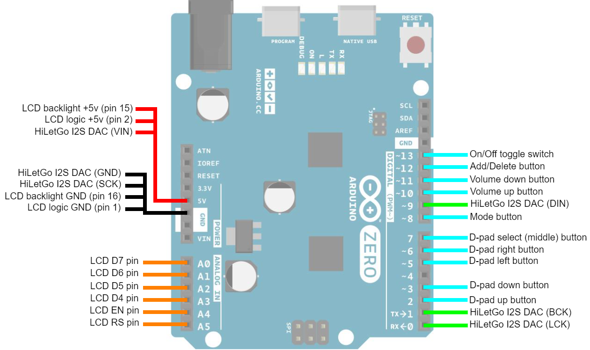
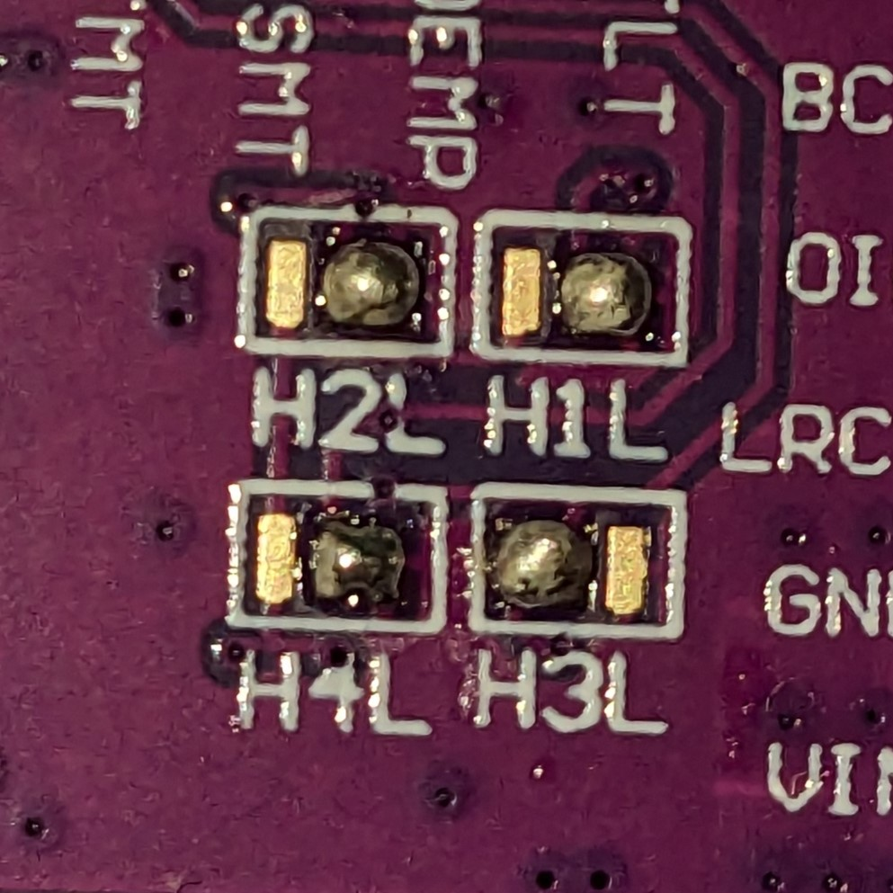
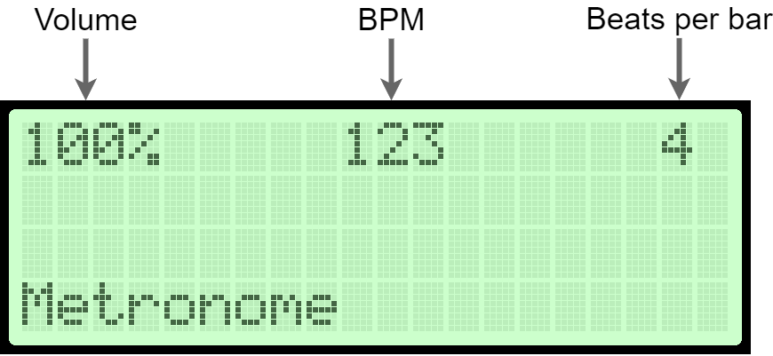
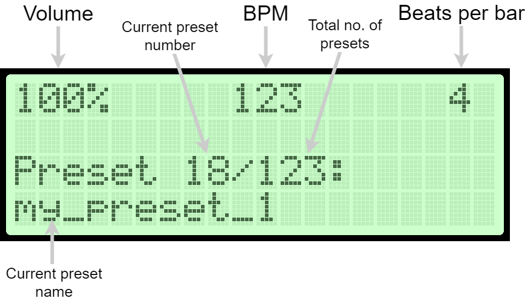
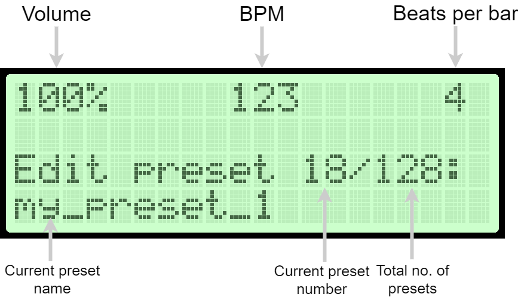
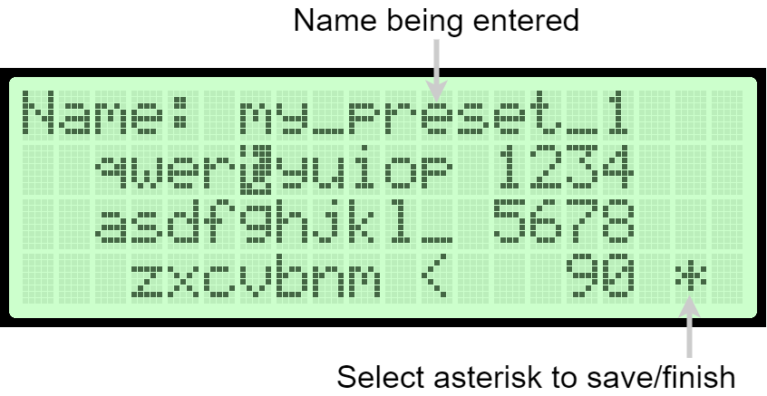
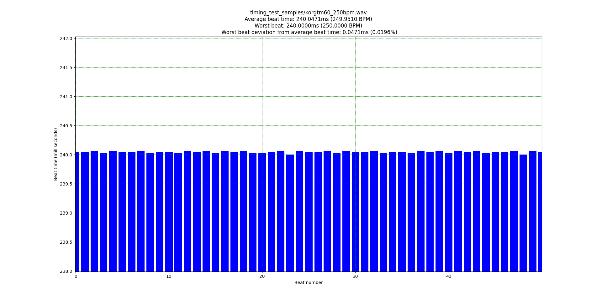
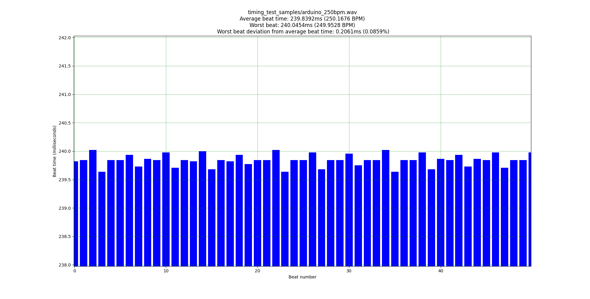
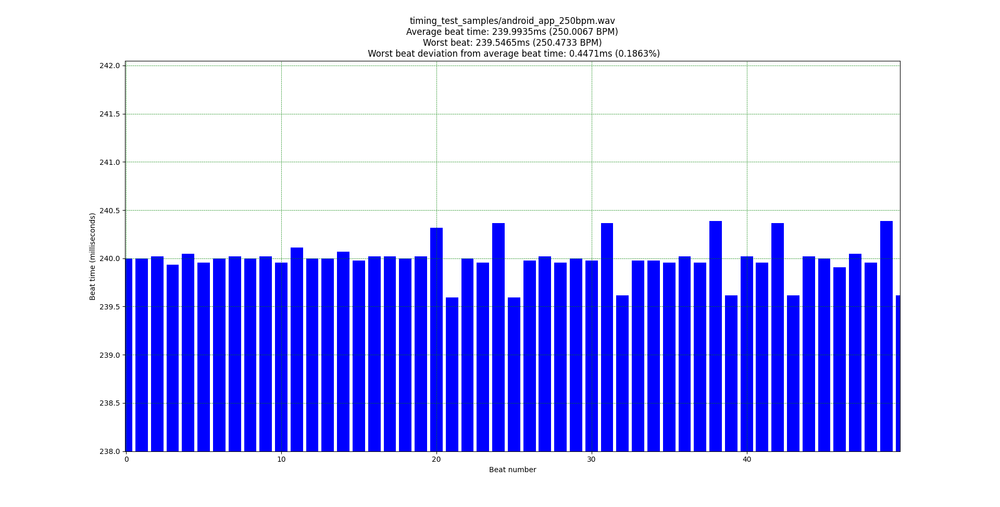

.. contents:: **Table of Contents**

Arduino Zero Stage Metronome
----------------------------

I created this metronome for use with my in-ear monitors during live performances.
Using a "regular" metronome (e.g. Korg TM60) is problematic, since you have to
stop and dial in the next BPM for each song, which slows down the set, and that
strategy also won't work for songs with tempo changes. I needed something that
would allow me to save multiple named presets for different songs, and switch
between them seamlessly by pressing a single button. This metronome project fills
that gap.

I am aware that many android/iOS metronome apps exist, and one may even exist that
provides all the features I need. However, I don't like the idea of using my phone
as a live/stage metronome, because if I forget to disable notifications / enable
airplane mode / do something to prevent phone calls and other sounds happening,
then I could get a call in the middle of a song and lose the metronome. Phones
are general-purpose devices, and there are many reasons that a phone might decide to
pause/mute the audio from your metronome app for something that it thinks is more
important. I want a dedicated metronome.

Features
========

* Uses high-quality 44.1KHz click sounds recorded directly from a Korg TM60 digital
  metronome (Stored on Arduino Zero internal flash, no external storage required).

* Supports up to 512 BPM (beats per minute), and up to 16 beats per bar.

* Supports creating & saving up to 128 presets. Each preset consists of a BPM
  value, a beats-per-bar value, and a string name that you choose yourself
  (Stored on Arduino Zero internal flash, no external storage required).

* Supports browsing/selecting presets by name.

* Supports switching to the next preset with a single button push, seamlessly
  (no matter when you press the button, the preset change will not be applied until
  the first beat of the next bar).

* Can be fully remotely/programatically controlled; all button presses can be "emulated"
  by sending serial commands to the Arduino Zero's serial port.

* Supports reading & writing saved preset data via the Arduino Zero's serial port.
  This makes it easy to migrate all your saved presets to another device.

* Arduino Zero internal flash (where all preset data is stored) is *only* written
  to when the device is powered off with a toggle switch, and only if any preset
  data has changed, in order to maximize the life of the device since the Arduino
  Zero internal flash has a limited number of write cycles.

Limitations
===========

* The project described here does not include a battery. Everything is powered via the
  Arduino Zero, and you can then power the Arduino Zero however you like (via USB cable
  or DC jack).

* I'm not a UI/UX designer, so the button choices & general flow through the various
  screens on the metronome are probably not ideal.

* Powering off the device with the on/off toggle switch, which is required to save
  any changed preset data, does not actually power off the Arduino Zero. Instead,
  it will disable all peripheral devices (LCD screen, I2S DAC, GPIO pins) and enter
  a low-power state via the Arduino `Low Power library <https://www.arduino.cc/reference/en/libraries/arduino-low-power>`_.

  This means the Arduino Zero will still draw some power (although, less), which
  might be noticeable if you are running this project from a battery.

Arduino Libraries required
==========================

Arduino Zero Stage Metronome requires the following Arduino libraries to be installed,
all of which can be obtained through the Arduino IDE's `Library Manager <https://docs.arduino.cc/software/ide-v1/tutorials/installing-libraries>`_:

* **Arduino_CRC32** (version 1.0.0)
* **FlashStorage** (version 1.0.0)
* **Arduino Low Power** (version 1.2.2)
* **LiquidCrystal** (version 1.0.7)

(The exact versions are not necessarily required, they were just the latest available versions
at the time when I installed them)

Hardware required
=================

* `Arduino Zero <https://store.arduino.cc/products/arduino-zero>`_ (Must be an Arduino Zero. Uno or other boards will not work.)
* `Adafruit 20x4 character LCD screen <https://www.adafruit.com/product/198>`_
* `HiLetgo PCM5102 I2S DAC <https://www.amazon.com/HiLetgo-Lossless-Digital-Converter-Raspberry/dp/B07Q9K5MT8>`_
* 9 pushbuttons, of whichever kind you want
* 1 toggle switch, of whichever kind you want

Wiring Diagram
==============

This diagram shows how all the components should be wired up to the Arduino Zero:

Required solder bridges on HiLetgo PCM5102 I2S DAC module
=========================================================

The underside of the PCB for the HiLetgo I2S DAC module has 4 sets of solder pads,
numbered 1 through 4, which must be bridged. They may already be bridged on the module
you bought, but if they are not, then you can use the following settings, which I found
to work well for this project:

* Bridge #1 (``H1L`` on the silkscreen): **LOW**
* Bridge #2 (``H2L`` on the silkscreen): **LOW**
* Bridge #3 (``H3L`` on the silkscreen): **HIGH**
* Bridge #4 (``H4L`` on the silkscreen): **LOW**

Here is an image of the solder bridges on my module, for reference:

Usage
=====

The following section describes what each button does on each screen of the metronome.

Metronome screen
################

This is the screen that will be showing on power-on.

* **D-pad up button**: Increases BPM
* **D-pad down button**: Decreases BPM
* **D-pad left button**: Decreases number of beats per bar
* **D-pad right button**: Increases number of beats per bar
* **D-pad middle button**: Start/stop metronome
* **Mode button**: Switch to preset playback screen
* **Add/Delete button**: Create new preset from current metronome settings (switches to name entry screen)

Preset playback screen
######################

This screen is used to edit/delete/play previously saved presets. This screen can
be reached by pressing the **Mode** button when on the metronome screen.

* **D-pad up button**: Switch to next preset
* **D-pad down button**: Switch to previous preset
* **D-pad left button**: Nothing
* **D-pad right button**: Nothing
* **D-pad middle button**: Start/stop metronome
* **Mode button**: Switch to metronome screen
* **Add/Delete button**: Edit or delete preset (shows two options to select, "Edit" or "Delete")

Preset edit screen
##################

This screen is used to edit a previously saved preset. This screen can be reached by
pressing the **Add/Delete** button when on the preset playback screen, and then selecting "Edit".

* **D-pad up button**: Increases BPM
* **D-pad down button**: Decreases BPM
* **D-pad left button**: Decreases number of beats per bar
* **D-pad right button**: Increases number of beats per bar
* **D-pad middle button**: Start/stop metronome
* **Mode button**: Prompt yes/no to save preset changes, then switch to preset playback screen
* **Add/Delete button**: Prompt yes/no to save preset changes, then switch to preset playback screen

Name entry screen
#################

This screen is used to enter a string to be used a name for a saved preset. This screen
can be reached by pressing the **Add/Delete** button when on the metronome screen.

* **D-pad up button**: Move cursor up
* **D-pad down button**: Move cursor down
* **D-pad left button**: Move cursor left
* **D-pad right button**: Move cursor right
* **D-pad middle button**: Select letter under cursor
* **Mode button**: Prompt yes/no to save the preset, then switch to metronome screen
* **Add/Delete button**: Prompt yes/no to save the preset, then switch back to metronome screen

NOTE: you can also select the asterisk **\*** with the cursor to save the preset without
prompting and return to the metronome screen.

Using the serial CLI interface
==============================

With the Arduino Zero connected via USB cable (the programming port, same USB
port used for flashing), open the Arduino IDE Serial Monitor at 115200 baud. Type
``help`` to see a list of available commands:

.. code::

	19:39:57.419 -> -------- CLI command reference ---------
	19:39:57.419 -> Version 0.0.1
	19:39:57.419 -> help      - Show this printout.
	19:39:57.419 -> presets   - Show all saved presets.
	19:39:57.419 -> addpreset - Create new preset. One line of output
	19:39:57.419 ->             from the 'presets' command should be passed
	19:39:57.450 ->             as parameter(s).
	19:39:57.450 -> off       - Save presets to flash, power off device.
	19:39:57.450 -> u         - Emulate UP button press.
	19:39:57.450 -> d         - Emulate DOWN button press.
	19:39:57.450 -> l         - Emulate LEFT button press.
	19:39:57.450 -> r         - Emulate RIGHT button press.
	19:39:57.450 -> s         - Emulate SELECT button press.
	19:39:57.450 -> m         - Emulate MODE button press.
	19:39:57.450 -> a         - Emulate ADD/DEL button press.
	19:39:57.495 -> +         - Emulate 'volume up' button press
	19:39:57.495 -> -         - Emulate 'volume down' button press
	19:39:57.496 -> ----------------------------------------

Backing up / creating presets via the ``scripts/preset_manager.py`` CLI tool
============================================================================

This section describes how to read/write preset data via the Arduino Zero Stage Metronome's
serial port. You will need to have Python 3x installed, and you will need to install
the ``pyserial`` python library (e.g. ``pip install pyserial``). You also need to connect
the Arduino Zero's programming port to your computer via USB cable (same USB port that you
use to program sketches onto the Arduino Zero).

Downloading saved presets from an Arduino Zero Stage Metronome
##############################################################

Use the ``scripts/preset_manager.py`` script with the ``save`` command to download saved
presets from a connected Arduino Zero Stage Metronome. The following command downloads saved
presets from an Arduino Zero Stage Metronome connected to COM14, and saves the downloaded
preset data in a file called ``saved_presets.txt``:

.. code::

    $ python scripts/preset_manager.py save -p COM14 -f saved_presets.txt

    Found 'Arduino Zero Stage Metronome 0.0.1' on COM14
    Downloading 12 presets
    12 preset(s) saved in 'saved_presets.txt'

Loading downloaded presets onto an Arduino Zero Stage Metronome
###############################################################

Use the ``scripts/preset_manager.py`` script with the ``load`` command to send downloaded
presets to a connected Arduino Zero Stage Metronome. The following command reads downloaded
presets from a file called ``saved_presets.txt`` and sends them to an Arduino Zero
Stage Metronome connected to COM14:

.. code::

    $ python scripts/preset_manager.py load -p COM14 -f saved_presets.txt

    Found 'Arduino Zero Stage Metronome 0.0.1' on COM14
    Succesfully loaded 12 new presets to metronome

    Remember to power off the metronome via toggle switch or via CLI 'off' command!

NOTE: After loading presets, whenever you want to power off the metronome, it is important
to power off the metronome via the toggle switch, OR via the CLI 'off' command. If power is
removed unexpectedly, then the presets you just loaded will not be saved.

Creating a single new preset and sending to Arduino Zero Stage Metronome
########################################################################

Use the ``scripts/preset_manager.py`` script with the ``addpreset`` command to define
the BPM, beat count and name for a new preset via command-line options, and send to
a connected Arduino Zero Stage Metronome. The following command creates a new preset called
"My preset" with a BPM of 123 and a beat count of 4, and sends the new preset to an
Arduino Zero Stage Metronome connected to COM14:

.. code::

    $ python scripts/preset_manager.py addpreset -p COM14 -b 123 -c 4 -n "My preset"

    Found 'Arduino Zero Stage Metronome 0.0.1' on COM14
    Succesfully loaded preset 'My preset' to metronome

    Remember to power off the metronome via toggle switch or via CLI 'off' command!

NOTE: After loading a preset, whenever you want to power off the metronome, it is important
to power off the metronome via the toggle switch, OR via the CLI 'off' command. If power is
removed unexpectedly, then the preset you just created will not be saved.

Timing/accuracy analysis
========================

The timing accuracy & consistency of the Arduino Zero metronome was compared to that
of the `Korg TM-60 metronome <https://www.korg.com/us/products/tuners/tm_60/>`_, and the
`most popular android metronome app <https://play.google.com/store/apps/details?id=com.andymstone.metronome&hl=en_US&gl=US&pli=1>`_
using the following method for each metronome:

* Record 60 seconds of a 250BPM click, using the 3.5mm audio socket (or, in the case of the android
  app, playing on a Pixel 6a and being recorded by a microphone connected to the same
  audio interface used to record the other metronomes).
* Analyze recorded audio using the ``scripts/analyze_wav_timing.py`` script

(.wav files used for test can be found in ``scripts/timing_test_samples``)

Summary of results
##################

The Arduino Zero metronome is measurably worse than the Korg TM-60, and measurably better
than the Android app, when it comes to accuracy & consistency. However the error factor for
the Arduino Zero metronome is still quite small, and still makes for a very usable metronome.

It is worth noting that the overall timing jitter for all 3 tested metronomes is still well below
1 millisecond, so all 3 metronomes are still perfectly usable in this regard. The full span of the Y
axes in the graphs below is only 4 milliseconds.

* *Korg TM-60 worst-case deviation from average beat time*: **0.0471 milliseconds (0.0196% of average beat time)**
* *Arduino Zero worst-case deviation from average beat time*: **0.2061 milliseconds (0.0859% of average beat time)**
* *Android "Metronome Beats" app worst-case deviation from average beat time*: **0.4471 milliseconds (0.1863% of average beat time)**

Korg TM-60 accuracy test results
################################

Arduino Zero accuracy test results
##################################

Android "Metronome Beats" app accuracy test results
###################################################

